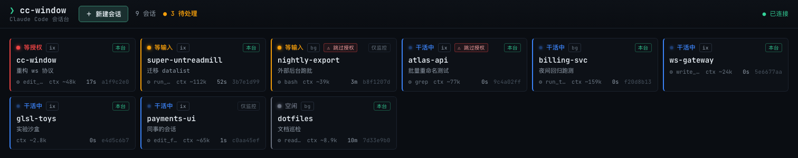

# cc-window


> A local web dashboard for **Claude Code**: monitor every session on your machine, spawn new ones, and drive each interactive terminal — all in one page. Listens on `127.0.0.1` only.

中文文档见 **[README.zh-CN.md](README.zh-CN.md)**.



---

## Why

When you run several Claude Code sessions across projects, you end up juggling a pile of terminal windows — no global view, no quick switching. cc-window collapses that into one local web page:

- **Monitor** — every session on the machine (interactive + background) in one grid, colour-coded by state: `等授权 / waiting permission`, `等输入 / waiting input`, `干活中 / working`, `空闲 / idle`.
- **Spawn** — create a session from the browser: pick a directory + model, one click launches a real interactive terminal.
- **Operate** — each session gets an `xterm.js` panel; type, answer permission prompts, switch model, end the session.
- **Hand off** — click *Open Terminal* to attach the session in your real local terminal; the web panel automatically goes read-only while the terminal drives, and back to interactive when you close it. (Always exactly one interactive client — no resize fights.)

## How it works (one line)

Claude Code has **no socket / port / HTTP query interface**. cc-window polls `claude agents --json` every ~1.5 s as the authoritative session roster, overlays a hooks-written event stream (`~/.claude/monitor/events.jsonl`) for sub-second state transitions and the precise wait reason, and starts/bridges sessions to the browser via `node-pty` (over a dedicated `tmux` backend by default). Full design in [`docs/`](docs/).

## Requirements

- **[Claude Code CLI](https://github.com/anthropics/claude-code)** installed and logged in (`claude` on your `PATH`).
- **Node.js ≥ 20**.
- **tmux** (recommended): enables the local-terminal hand-off and survives server restarts. Without it, cc-window falls back to a direct `node-pty` backend (sessions end when the server stops).
- The one-click **Open Terminal** button uses `osascript` + Terminal.app and is **macOS-only**; on other platforms it falls back to copying the `tmux attach` command. Everything else is cross-platform.

> ⚠️ `node-pty` is a native module. npm ships prebuilt binaries for common platforms; otherwise it compiles on install (needs a C/C++ toolchain).

## Quick start

### Via npx (no clone)

```bash
npx cc-window                 # start the dashboard → http://127.0.0.1:4317
npx cc-window install-hooks   # (optional) install monitoring hooks; --dry-run / --uninstall
```

### From source

```bash
git clone https://github.com/pickjason/cc-windows.git
cd cc-windows
npm run setup                 # npm install + build
npm start                     # → http://127.0.0.1:4317

# optional: richer, sub-second status via hooks (writes ~/.claude/settings.json,
# auto-backed up; preview with --dry-run, revert with --uninstall)
npm run install-hooks
```

Dev mode with frontend HMR: `npm run dev` (Vite on `5173`, server on `4317`).

## Configuration

Environment variables (all optional):

| Var | Default | Meaning |
|---|---|---|
| `CC_PORT` / `PORT` | `4317` | HTTP/WS port |
| `CC_HOST` | `127.0.0.1` | Bind address |
| `CC_TMUX_SOCKET` | `ccwindow` | Dedicated tmux socket name (`tmux -L <name>`) |

## Security

- Binds to `127.0.0.1` by default — not exposed to the network. There is **no built-in auth token**; anyone who can reach the port can control your sessions.
- **Do not** set `CC_HOST` to a non-loopback address unless you fully understand you are exposing session control to your network.
- The monitoring logger **does not record prompt text** by default — see [`docs/06-hooks-setup.md`](docs/06-hooks-setup.md).
- Sessions launched with **Skip permissions** (`--dangerously-skip-permissions`) run without confirmation prompts — cards flag these with a red `⚠ 跳过授权` badge. Use only in trusted directories.

## Notes

- **本台 / managed** cards were started by cc-window and are fully operable; **仅监控 / monitor-only** cards (sessions you opened elsewhere) can only be watched — clicking one prefills *New Session* with the same directory.
- First launch in an **untrusted directory**: Claude shows a "trust this folder?" prompt in the terminal; press Enter there before the session registers and appears on the board.
- **Close panel (×) ≠ End session.** Closing a tab detaches the web panel; the session keeps running. *End session* actually kills it.

## Docs

| Doc | Contents |
|---|---|
| [01-overview](docs/01-overview.md) | Background, goals, scope, glossary |
| [02-claude-code-observability](docs/02-claude-code-observability.md) | The verified facts about Claude Code's observable surface |
| [03-architecture](docs/03-architecture.md) | Components, data flow, session lifecycle |
| [04-status-model](docs/04-status-model.md) | Three-source status normalization + state machine |
| [05-protocol](docs/05-protocol.md) | REST + WebSocket message contract |
| [06-hooks-setup](docs/06-hooks-setup.md) | Hooks logger, privacy, install script |
| [08-terminal-handoff](docs/08-terminal-handoff.md) | Web ⇄ local-terminal interactive/read-only switching |
| [09-ui-interaction-spec](docs/09-ui-interaction-spec.md) | Full UI interaction/behavior contract |

## Contributing

Issues and PRs welcome. Before a PR: `npm run typecheck && npm run build`.

## License

[MIT](LICENSE)
